# SWR Cache Architecture

This document provides a detailed architectural overview of the SWR (Stale-While-Revalidate) cache implementation, including visual representations of key components and processes.

## Table of Contents

1. [Architecture Overview](#architecture-overview)
2. [Core Components](#core-components)
3. [SWR Cache Lifecycle](#swr-cache-lifecycle)
4. [Singleflight Mechanism](#singleflight-mechanism)
5. [Circuit Breaker Pattern](#circuit-breaker-pattern)
6. [Dynamic TTL Strategy](#dynamic-ttl-strategy)
7. [Performance Characteristics](#performance-characteristics)

## Architecture Overview

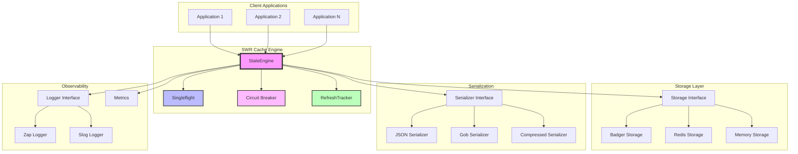

## Core Components

### StaleEngine
The heart of the SWR cache that orchestrates all caching operations:

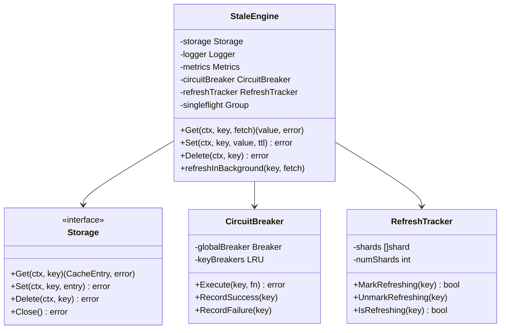

## SWR Cache Lifecycle

The three-phase TTL system ensures optimal performance and availability:

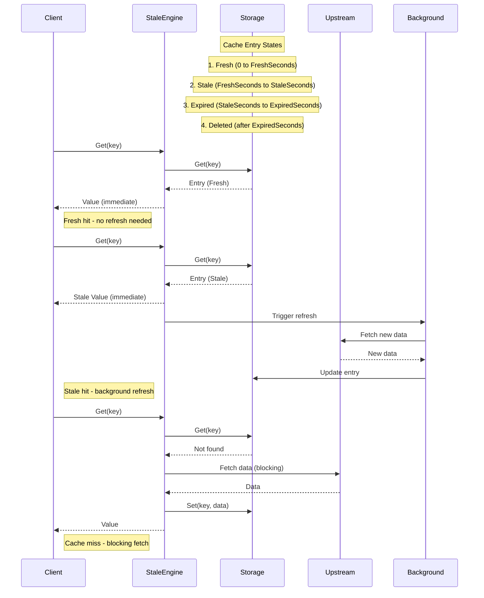

### TTL Phase Transitions

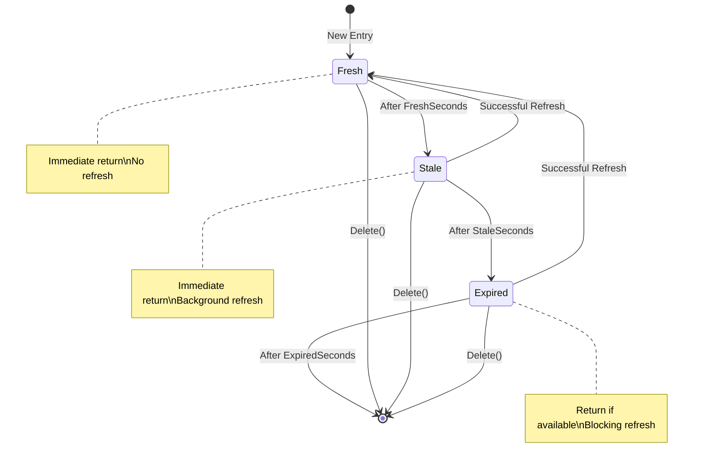

## Singleflight Mechanism

Prevents cache stampede by ensuring only one upstream request per key:

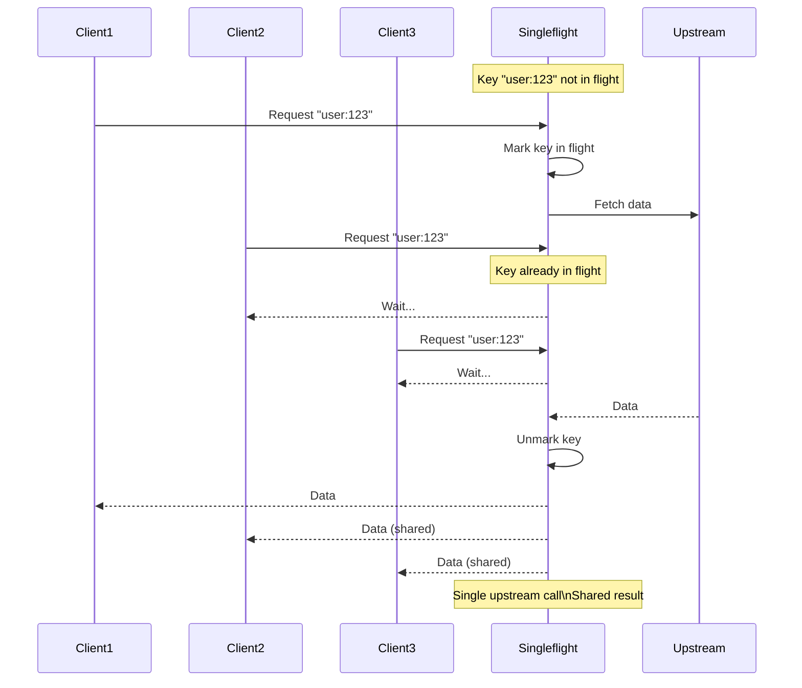

### Singleflight Benefits

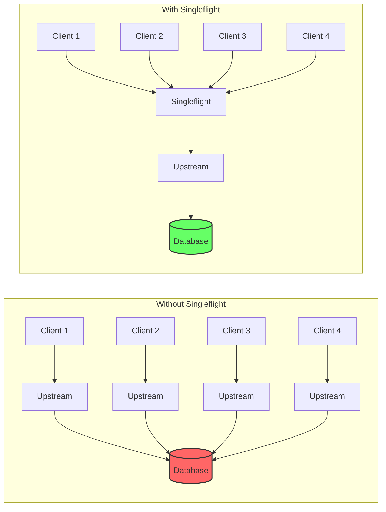

## Circuit Breaker Pattern

Protects the system from cascading failures:

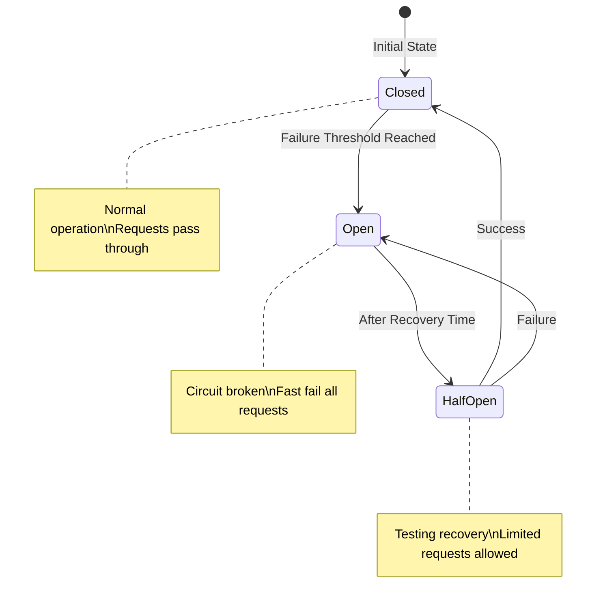

### Circuit Breaker Flow

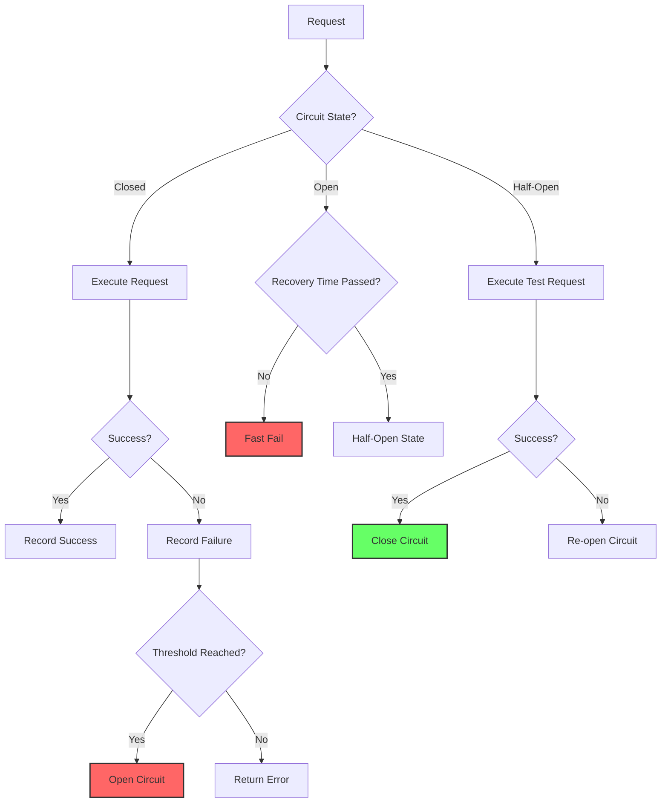

### Per-Key Circuit Breaking

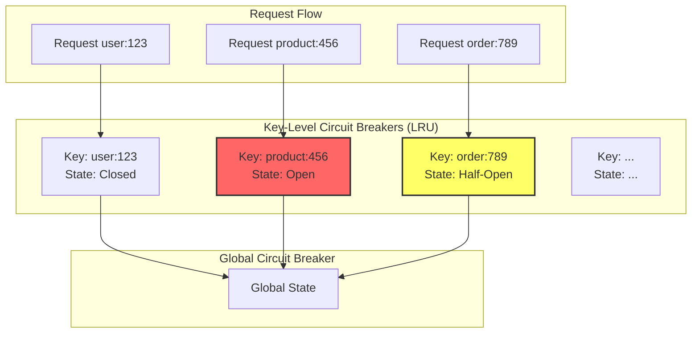

## Dynamic TTL Strategy

Flexible TTL configuration based on content or patterns:

```mermaid
flowchart TD
    A[Cache Entry] --> B{TTL Strategy}
    
    B --> C[Default TTL]
    B --> D[Pattern-Based TTL]
    B --> E[Content-Based TTL]
    B --> F[Dynamic TTL Function]
    
    C --> G[Fixed Duration<br/>Fresh: 5m<br/>Stale: 1h<br/>Expired: 1h]
    
    D --> H{Key Pattern}
    H -->|user:*| I[Short TTL<br/>Fresh: 1m<br/>Stale: 5m]
    H -->|config:*| J[Long TTL<br/>Fresh: 1h<br/>Stale: 24h]
    H -->|session:*| K[Medium TTL<br/>Fresh: 15m<br/>Stale: 30m]
    
    E --> L{Content Type}
    L -->|Large Data| M[Extended TTL]
    L -->|Frequently Updated| N[Short TTL]
    L -->|Static Content| O[Long TTL]
    
    F --> P[Custom Function<br/>f(key, value) → TTL]
```

### TTL Configuration Examples

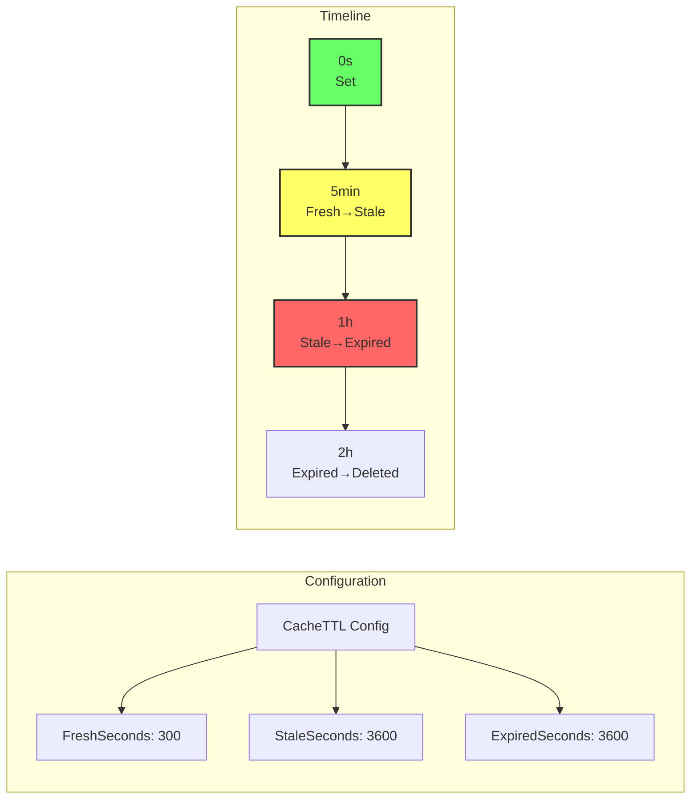

## Performance Characteristics

### Hot Path Optimization

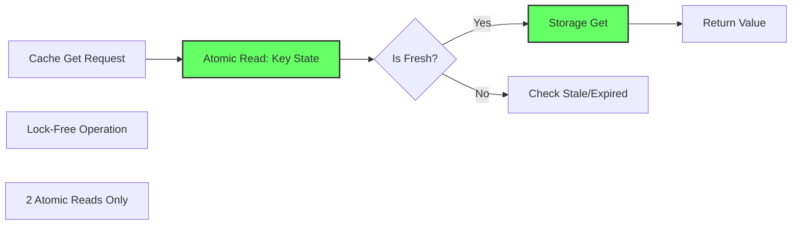

### Concurrent Request Handling

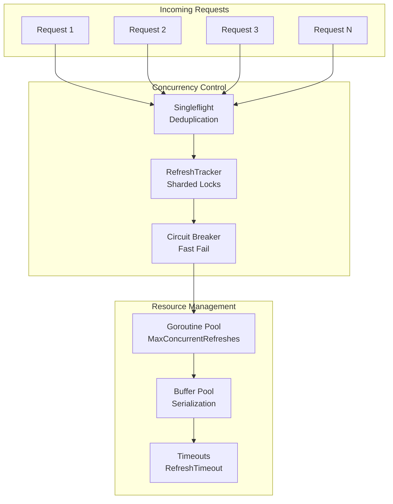

### Memory Efficiency

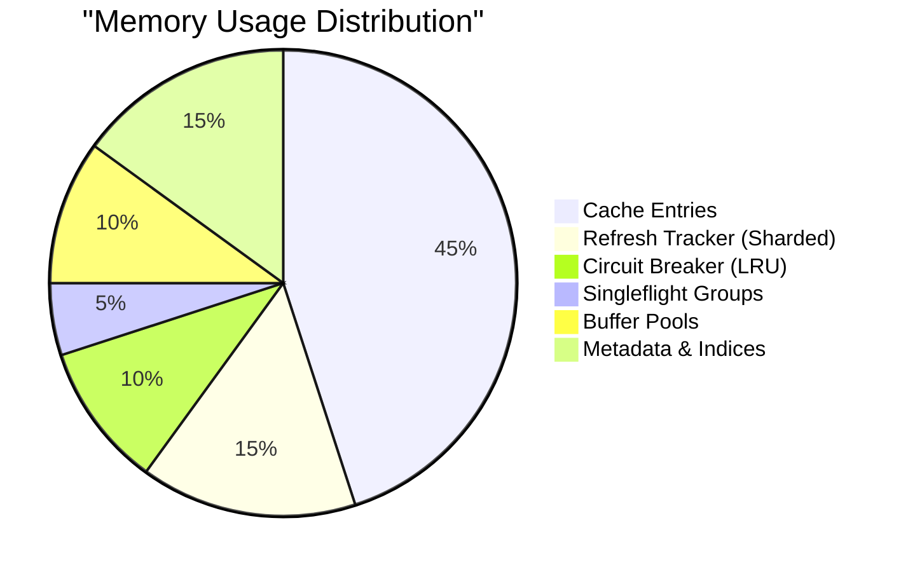

## Summary

The SWR Cache architecture is designed for:

1. **High Performance**: Lock-free hot path, minimal atomic operations
2. **Resilience**: Circuit breakers, graceful degradation
3. **Efficiency**: Singleflight deduplication, sharded locks
4. **Flexibility**: Pluggable storage, serializers, and metrics
5. **Observability**: Comprehensive logging and metrics

This architecture enables applications to achieve:
- Sub-millisecond cache hits
- Automatic background refresh
- Protection from cache stampedes
- Graceful handling of failures
- Scalability to millions of requests